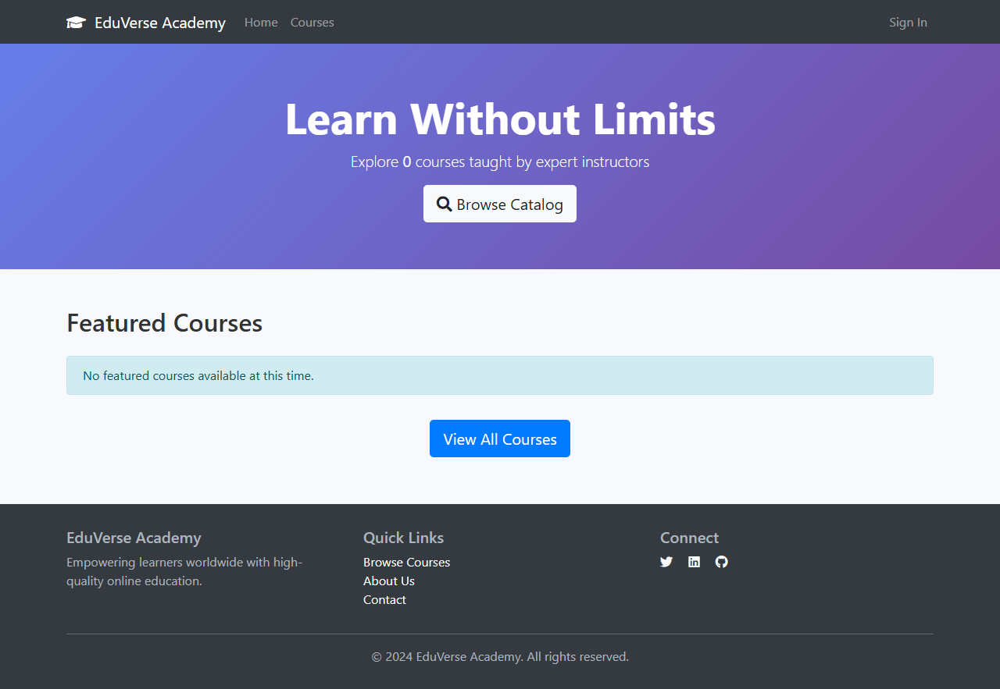
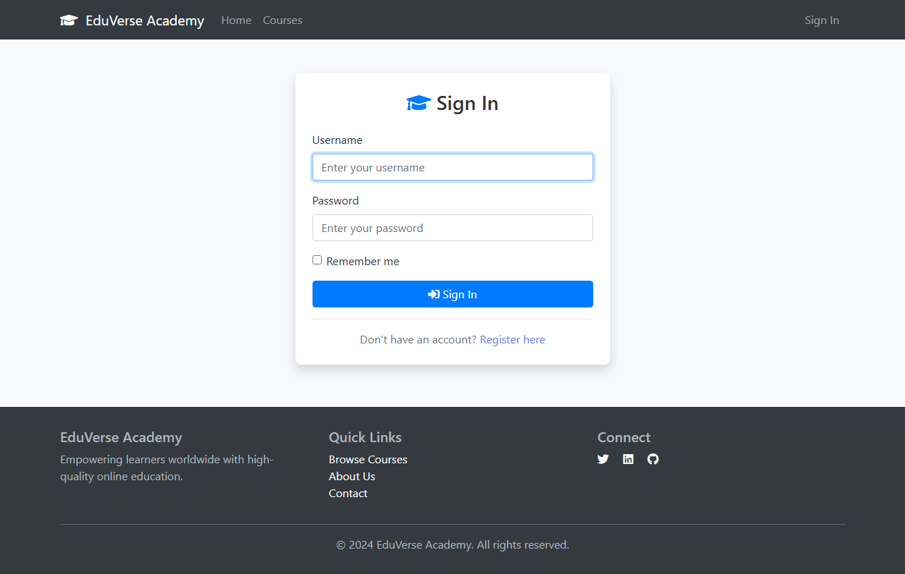

## Initial Application Screenshots

The following screenshots show the EduVerse Academy monolith running locally via Docker Compose (Tomcat 9 + PostgreSQL 14).

### Homepage

The landing page features a hero banner, featured courses section, and navigation bar with links to the course catalog, sign-in, and more.

### Login Page

Spring Security form-based authentication with username/password fields and a "Remember me" option.

### Course Catalog

The course catalog page (empty database — no courses seeded yet). This is one of the 8 bounded contexts targeted for extraction.

